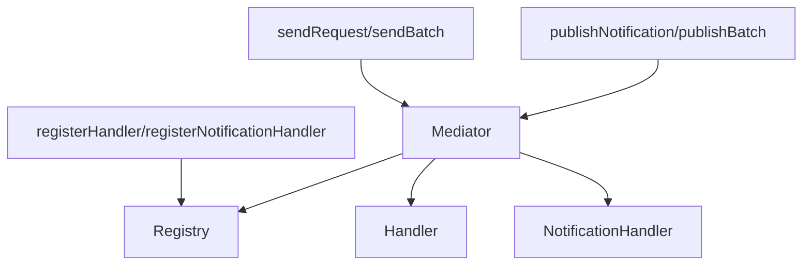

# ts-micro-mediator - Architecture & Codebase Guide

## 1. Mục tiêu
- Cung cấp Mediator Pattern tối ưu cho Cloudflare Workers, edge/serverless, Node.js, Bun, Deno.
- Đơn giản, memory footprint nhỏ, dễ mở rộng, type-safe.

## 2. Cấu trúc thư mục/file

```
ts-micro-mediator/
├── src/
│   ├── index.ts            # Entry point, export public API
│   ├── public-types.ts     # Public interfaces cho user (IQuery, ICommand, INotification)
│   ├── types.ts            # Internal types/interfaces (IRequest, handlers, registry)
│   ├── mediator.ts         # Core Mediator class & factory
│   ├── registry.ts         # Handler registry (request/notification)
│   ├── helpers.ts          # Helper functions (register, batch, ...)
│   ├── middleware.ts       # Middleware & helper cho framework
│   ├── mediator-errors.ts  # Error definitions
│   ├── generate-handlers.js # Auto-generate handler registration
│   ├── generated-handlers.ts # Auto-generated file (ignore)
├── dist/                   # Build output (ignore)
├── examples/               # Example usage
├── package.json, tsconfig.json, ...
```

## 3. Vai trò từng file chính
- **index.ts**: Chỉ export public API, không lộ implementation.
- **public-types.ts**: Interface cho user implement (IQuery, ICommand, INotification, IMediator).
- **types.ts**: Internal types, handler signatures, registry interface, IRequest (internal).
- **mediator.ts**: Mediator class (core logic), singleton factory.
- **registry.ts**: Lưu trữ, truy xuất handler, request/notification class.
- **helpers.ts**: Đăng ký handler, batch, tạo instance từ data, reset registry.
- **middleware.ts**: Middleware cho framework (Hono, Express, Elysia, ...), helper gửi request/notification.
- **mediator-errors.ts**: Định nghĩa lỗi chuẩn cho mediator.
- **generate-handlers.js**: Script tự động generate handler registration từ file .handler.ts.

## 4. Interface Design

### Public Interfaces (User-facing):
- `IQuery<TResponse>` - Cho read operations (queries)
- `ICommand<TResponse>` - Cho write operations (commands)  
- `INotification` - Cho events/notifications
- `IMediator` - Interface cho mediator

### Internal Interfaces:
- `IRequest<TResponse>` - Base interface cho internal implementation
- `IQuery` và `ICommand` extend từ `IRequest`

### Type Signatures:
```typescript
// Handler registration - chỉ cần 1 generic parameter
registerHandler<TResponse>(
  requestType: string,
  handler: (request: IRequest<TResponse>) => Promise<Result<TResponse>>
): void

// Handler function signature
type RequestHandler<TRequest, TResponse> = 
  (request: TRequest) => Promise<Result<TResponse>>

// User chỉ cần implement IQuery hoặc ICommand
class GetUserQuery implements IQuery<User> { ... }
class CreateUserCommand implements ICommand<User> { ... }
```

## 5. Flow xử lý request/notification



- Đăng ký handler/class qua helpers → lưu vào Registry (singleton)
- Gửi request/notification qua helper/middleware → Mediator lấy handler từ Registry, thực thi
- Kết quả trả về dạng Result (ok/err)

## 6. Middleware Integration

### Direct Usage (Recommended)
The mediator works with any framework without middleware:
```typescript
import { sendRequest } from 'ts-micro-mediator';

// Works with Hono, Express, Fastify, Elysia, etc.
const result = await sendRequest(new GetUserQuery('123'));
```

### Optional Middleware
For middleware-style integration:
```typescript
import { mediatorMiddleware } from 'ts-micro-mediator';

// Hono
app.use('*', mediatorMiddleware());

// Express
app.use(mediatorMiddleware());
```

**Middleware benefits:**
- **Context injection**: Mediator instance automatically available in request context
- **Error handling**: Centralized error handling for mediator operations
- **Framework integration**: Better integration with framework's request/response lifecycle
- **Middleware chain**: Can be combined with authentication, logging, etc.

**Use cases:**
- **Direct usage**: Simple apps, microservices, basic mediator needs
- **Middleware**: Complex apps, framework integration features, error handling needs

### Framework Compatibility
- **Cloudflare Workers**: Hono, native
- **Node.js**: Express, Fastify, Koa
- **Bun**: Elysia, native
- **Deno**: Oak, native
- **Any HTTP framework**: Direct usage

## 7. Cách mở rộng/đăng ký handler

### Manual Registration:
```typescript
class GetUserQuery implements IQuery<User> {
  constructor(public userId: string) {}
}

registerHandler('GetUserQuery', async (query) => {
  return ok(user);
});
```

### Auto-generation (Recommended):
1. Tạo file `src/users/get-user.handler.ts`:
```typescript
export const getUserHandler = async (query: GetUserQuery) => {
  return ok(user);
};
```

2. Tạo file `src/users/get-user.query.ts`:
```typescript
export class GetUserQuery implements IQuery<User> {
  constructor(public userId: string) {}
}
```

3. Chạy script generate:
```bash
node src/generate-handlers.js
```

4. Import auto-generated file:
```typescript
import './generated-handlers.js';
```

## 8. Lưu ý tối ưu cho edge
- Singleton pattern, lazy init, không giữ state thừa
- Không dùng console, không log runtime
- Không cache dư thừa, không queue nội bộ
- Tất cả lookup O(1), batch O(n)
- Không phụ thuộc Node.js, có thể dùng trên Bun, Deno, Cloudflare Workers

## 9. Ví dụ sử dụng tổng quát
```typescript
import {
  IQuery, ICommand, registerHandler, sendRequest, sendBatch, publishNotification, mediatorMiddleware
} from 'ts-micro-mediator';

// Query (read)
class GetUserQuery implements IQuery<User> {
  constructor(public userId: string) {}
}

// Command (write)
class CreateUserCommand implements ICommand<User> {
  constructor(public name: string, public email: string) {}
}

// Notification (event)
class UserCreatedNotification implements INotification {
  constructor(public user: User) {}
}

registerHandler('GetUserQuery', async (query) => {
  return ok(user);
});

registerHandler('CreateUserCommand', async (command) => {
  const user = await createUser(command.name, command.email);
  return ok(user);
});

// Gửi request
const result = await sendRequest(new GetUserQuery('123'));

// Batch
const results = await sendBatch([
  new GetUserQuery('1'),
  new CreateUserCommand('John', 'john@example.com')
]);

// Middleware (Hono, Express, Elysia, ...)
app.use(mediatorMiddleware());
```

## 10. Liên hệ các thành phần
- **User chỉ cần import từ index.ts** (public API)
- **Không cần quan tâm Registry/Mediator internal**
- **Helpers/middleware** là entrypoint chính cho mọi flow
- **Tất cả handler/notification đều đăng ký qua helpers**
- **Không cần quản lý lifecycle, singleton tự động**
- **Auto-generation giúp giảm boilerplate code**

---
**Mọi thắc mắc, xem thêm README.md hoặc liên hệ maintainer.** 