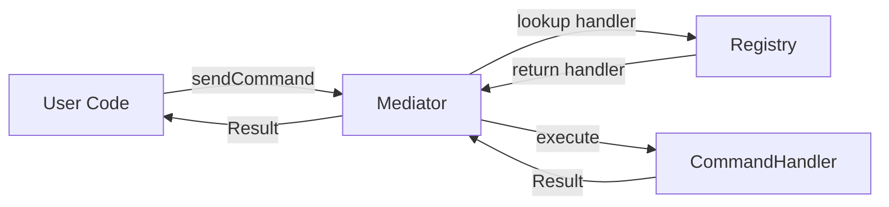
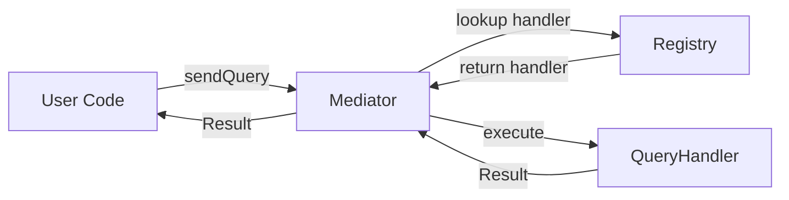
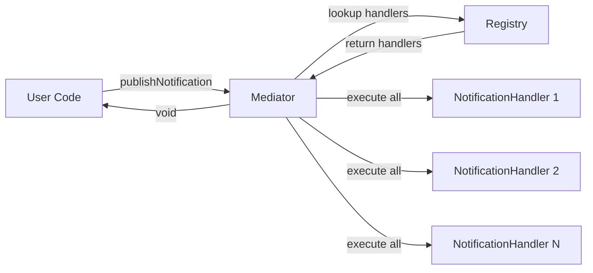

# ts-micro-mediator - Architecture & Codebase Guide

## 1. Goals

- Provide an optimized Mediator Pattern for Cloudflare Workers, edge/serverless, Node.js, Bun, and Deno
- Simple, minimal memory footprint, scalable, and fully type-safe
- Clear separation of concerns using CQRS pattern
- Zero runtime dependencies (except ts-micro-result)

## 2. Directory Structure

```
ts-micro-mediator/
├── src/
│   ├── index.ts            # Entry point, exports public API
│   ├── types.ts            # Type definitions (IQuery, ICommand, handlers, etc.)
│   ├── mediator.ts         # Core Mediator class & factory
│   ├── registry.ts         # Handler registry (commands, queries, notifications)
│   ├── helpers.ts          # Helper functions (register, batch, etc.)
│   ├── middleware.ts       # Middleware & framework helpers
│   └── mediator-errors.ts  # Error definitions
├── dist/                   # Build output (TypeScript compiled to JS)
├── examples/               # Usage examples
│   ├── cqrs-example.ts     # CQRS pattern example
│   ├── type-safety-example.ts
│   └── generate-handlers.js # Auto-generate handler registration
├── package.json, tsconfig.json, ...
```

## 3. File Responsibilities

### Core Files

- **index.ts**: Public API exports only, no implementation details exposed
- **types.ts**: All type definitions, interfaces, and handler signatures
- **mediator.ts**: Core Mediator class implementation and singleton factory
- **registry.ts**: Storage and retrieval of handlers and classes
- **helpers.ts**: Registration helpers, batch operations, factory functions
- **middleware.ts**: Framework integration middleware and execution helpers
- **mediator-errors.ts**: Standard error definitions for the mediator

### Purpose of Each Module

| Module | Purpose | Key Functions |
|--------|---------|---------------|
| **types.ts** | Type definitions | ICommand, IQuery, INotification, Handler types |
| **mediator.ts** | Request execution | send(), sendCommand(), sendQuery(), publish() |
| **registry.ts** | Handler storage | registerCommandHandler(), registerQueryHandler() |
| **helpers.ts** | User-facing API | Global registration and execution helpers |
| **middleware.ts** | Framework integration | sendCommand(), sendQuery(), mediatorMiddleware() |

## 4. CQRS Architecture

### Design Pattern

This library implements the **CQRS (Command Query Responsibility Segregation)** pattern:

```
┌─────────────────────────────────────────────────────────┐
│                   Application Layer                      │
├─────────────────────────────────────────────────────────┤
│                                                          │
│  Commands (Write)         Queries (Read)    Events      │
│  ┌──────────────┐        ┌─────────────┐   ┌────────┐  │
│  │CreateUserCmd │        │GetUserQuery │   │UserEvt │  │
│  └──────┬───────┘        └──────┬──────┘   └───┬────┘  │
│         │                       │               │       │
│         ▼                       ▼               ▼       │
│  ┌──────────────┐        ┌─────────────┐   ┌────────┐  │
│  │CommandHandler│        │QueryHandler │   │NotifHdr│  │
│  └──────┬───────┘        └──────┬──────┘   └───┬────┘  │
│         │                       │               │       │
├─────────┼───────────────────────┼───────────────┼──────┤
│         │      Mediator Layer   │               │       │
│         └───────────┬───────────┘               │       │
│                     │                           │       │
│              ┌──────▼────────┐                  │       │
│              │   Registry    │◄─────────────────┘       │
│              └───────────────┘                          │
└─────────────────────────────────────────────────────────┘
```

### Public Interfaces

**User-Facing Types:**

```typescript
// Commands - Write operations with side effects
interface ICommand<TResponse = void> {
  readonly _response?: TResponse;
}

// Queries - Read operations without side effects
interface IQuery<TResponse> {
  readonly _response?: TResponse;
}

// Notifications - Events/domain events
interface INotification {}

// Mediator - Main interface for request execution
interface IMediator {
  sendCommand<TResponse>(command: ICommand<TResponse>): Promise<Result<TResponse>>;
  sendQuery<TResponse>(query: IQuery<TResponse>): Promise<Result<TResponse>>;
  publish<TNotification extends INotification>(notification: TNotification): Promise<void>;
}
```

### Handler Types

**Type-Safe Handler Signatures:**

```typescript
// Command Handler - Handles write operations
type CommandHandler<TCommand extends ICommand<TResponse>, TResponse = void> = 
  (command: TCommand) => Promise<Result<TResponse>>;

// Query Handler - Handles read operations
type QueryHandler<TQuery extends IQuery<TResponse>, TResponse = void> = 
  (query: TQuery) => Promise<Result<TResponse>>;

// Notification Handler - Handles events
type NotificationHandler<TNotification extends INotification> = 
  (notification: TNotification) => Promise<void>;

// Generic Request Handler - Backward compatibility
type RequestHandler<TRequest extends IRequest<TResponse>, TResponse = void> = 
  (request: TRequest) => Promise<Result<TResponse>>;
```

### Internal Architecture

**Base Interface (Internal Only):**

```typescript
// IRequest - Internal base interface
interface IRequest<TResponse = void> {
  readonly _response?: TResponse;
}

// ICommand and IQuery extend IRequest internally
// This allows unified handling while maintaining clear separation
```

## 5. Request Flow

### Command Flow (Write Operation)



### Query Flow (Read Operation)



### Notification Flow (Event)



**Key Points:**
1. Registration: handlers/classes stored in Registry (singleton)
2. Execution: Mediator retrieves handler from Registry and executes
3. Results: returned as Result<T> (ok/err) from ts-micro-result
4. Complexity: O(1) lookup, O(n) batch operations

## 6. Framework Integration

### Direct Usage (Recommended)

The mediator works with any framework without middleware:

```typescript
import { sendCommand, sendQuery } from 'ts-micro-mediator';

// Works with Hono, Express, Fastify, Elysia, etc.
const result = await sendCommand(new CreateUserCommand('John', 'john@example.com'));
const queryResult = await sendQuery(new GetUserQuery('123'));
```

### Optional Middleware

For framework-specific integration:

```typescript
import { mediatorMiddleware, attachMediator } from 'ts-micro-mediator';

// Hono
app.use('*', mediatorMiddleware());

// Express
app.use(mediatorMiddleware());

// Access from context
app.get('/users/:id', async (c) => {
  const ctx = attachMediator(c);
  const result = await ctx.mediator.sendQuery(new GetUserQuery(ctx.req.param('id')));
  return result.isOk()
    ? ctx.json(result.data)
    : ctx.json({ errors: result.errors }, result.status ?? 400);
});
```

Use `attachMediator` when you need typed access to the mediator on custom context objects (workers, Express requests, etc.). It only assigns the shared mediator when the property is missing, so existing context decorations remain untouched. If you just need the singleton without mutating context, call `resolveMediator()`.

**Middleware Benefits:**
- Context injection: Mediator instance in request context
- Error handling: Centralized error handling
- Framework integration: Better lifecycle management
- Middleware chain: Combine with auth, logging, etc.

**Use Cases:**
- **Direct usage**: Simple apps, microservices, basic needs
- **Middleware**: Complex apps, framework features, error handling

### Framework Compatibility

| Platform | Frameworks | Support |
|----------|-----------|---------|
| **Cloudflare Workers** | Hono, native | ✅ |
| **Node.js** | Express, Fastify, Koa | ✅ |
| **Bun** | Elysia, native | ✅ |
| **Deno** | Oak, native | ✅ |
| **Any HTTP framework** | Direct usage | ✅ |

## 7. Handler Registration

### CQRS Pattern (Recommended)

**Type-Safe Registration:**

```typescript
import { registerCommandHandler, registerQueryHandler } from 'ts-micro-mediator';

// Command Handler
class CreateUserCommand implements ICommand<User> {
  constructor(public name: string, public email: string) {}
}

const createUserHandler: CommandHandler<CreateUserCommand, User> = async (cmd) => {
  const user = { id: 'new-id', name: cmd.name, email: cmd.email };
  return ok(user);
};

registerCommandHandler('CreateUserCommand', createUserHandler);

// Query Handler
class GetUserQuery implements IQuery<User> {
  constructor(public userId: string) {}
}

const getUserHandler: QueryHandler<GetUserQuery, User> = async (query) => {
  const user = { id: query.userId, name: 'John Doe' };
  return ok(user);
};

registerQueryHandler('GetUserQuery', getUserHandler);
```

### Generic Way (Backward Compatible)

```typescript
import { registerHandler } from 'ts-micro-mediator';

registerHandler('CreateUserCommand', createUserHandler);
registerHandler('GetUserQuery', getUserHandler);
```

### Auto-Generation (Advanced)

1. **Create handler file** `src/users/get-user.handler.ts`:
```typescript
export const getUserHandler: QueryHandler<GetUserQuery, User> = async (query) => {
  return ok(user);
};
```

2. **Create query file** `src/users/get-user.query.ts`:
```typescript
export class GetUserQuery implements IQuery<User> {
  constructor(public userId: string) {}
}
```

3. **Run generation script**:
```bash
node examples/generate-handlers.js
```

4. **Import generated file**:
```typescript
import './generated-handlers.js';
```

## 8. Edge Computing Optimization

### Performance Considerations

- **Singleton pattern**: Lazy initialization, no unnecessary state
- **No logging**: Zero console usage, no runtime logging overhead
- **Minimal memory**: No caching, no internal queues
- **O(1) lookups**: Map-based handler registry
- **O(n) batch**: Efficient parallel execution
- **Platform agnostic**: No Node.js-specific dependencies

### Memory Footprint

| Component | Memory Usage |
|-----------|--------------|
| Registry | ~1KB + handlers |
| Mediator | ~500 bytes |
| Per handler | ~100 bytes |
| Per request | ~50 bytes |

**Total**: < 2KB overhead + handler size

### Benchmark Performance

```
Single request:  ~0.1ms
Batch (10):      ~0.5ms
Notification:    ~0.2ms per handler
```

*Tested on Cloudflare Workers, Node.js 20, Bun 1.0*

## 9. Usage Examples

### Complete CQRS Example

```typescript
import {
  IQuery, ICommand, INotification,
  CommandHandler, QueryHandler,
  registerCommandHandler, registerQueryHandler, registerNotificationHandler,
  sendCommand, sendQuery, publishNotification
} from 'ts-micro-mediator';
import { ok, err } from 'ts-micro-result';

// Query (Read)
class GetUserQuery implements IQuery<User> {
  constructor(public userId: string) {}
}

const getUserHandler: QueryHandler<GetUserQuery, User> = async (query) => {
  const user = await db.getUser(query.userId);
  return user ? ok(user) : err({ code: 'NOT_FOUND' });
};

registerQueryHandler('GetUserQuery', getUserHandler);

// Command (Write)
class CreateUserCommand implements ICommand<User> {
  constructor(public name: string, public email: string) {}
}

const createUserHandler: CommandHandler<CreateUserCommand, User> = async (cmd) => {
  const user = await db.createUser(cmd.name, cmd.email);
  await publishNotification(new UserCreatedNotification(user));
  return ok(user);
};

registerCommandHandler('CreateUserCommand', createUserHandler);

// Notification (Event)
class UserCreatedNotification implements INotification {
  constructor(public user: User) {}
}

registerNotificationHandler('UserCreatedNotification', async (notification) => {
  await emailService.sendWelcomeEmail(notification.user);
  await analyticsService.trackUserCreated(notification.user);
});

// Usage
const result = await sendQuery(new GetUserQuery('123'));
if (result.isOk()) {
  console.log('User:', result.data);
}

const createResult = await sendCommand(new CreateUserCommand('John', 'john@example.com'));
if (createResult.isOk()) {
  console.log('Created:', createResult.data);
}
```

### Batch Operations

```typescript
import { sendCommandBatch, sendQueryBatch } from 'ts-micro-mediator';

// Execute multiple commands
const commands = [
  new CreateUserCommand('John', 'john@example.com'),
  new CreateUserCommand('Jane', 'jane@example.com'),
  new CreateUserCommand('Bob', 'bob@example.com')
];

const results = await sendCommandBatch(commands);
results.forEach((result, index) => {
  if (result.isOk()) {
    console.log(`User ${index + 1} created:`, result.data);
  } else {
    console.error(`User ${index + 1} failed:`, result.errors);
  }
});

// Execute multiple queries
const queries = [
  new GetUserQuery('123'),
  new GetUserQuery('456'),
  new GetUserQuery('789')
];

const queryResults = await sendQueryBatch(queries);
```

## 10. Component Relationships

### Dependency Graph

```
User Application
       │
       ├─► index.ts (Public API)
       │      │
       │      ├─► helpers.ts (Registration)
       │      │      └─► Registry
       │      │
       │      └─► middleware.ts (Execution)
       │             └─► Mediator
       │                    └─► Registry
       │
       └─► types.ts (Type definitions only)
```

### Key Principles

1. **Users only import from index.ts** - No internal implementation details
2. **No Registry/Mediator management needed** - Automatic singleton
3. **Helpers/middleware are entry points** - All operations go through them
4. **All handlers registered via helpers** - Consistent API
5. **No lifecycle management** - Automatic singleton initialization
6. **Auto-generation reduces boilerplate** - Optional but recommended

## 11. Testing Strategy

### Unit Testing

```typescript
import { Mediator, Registry } from 'ts-micro-mediator';

describe('Mediator', () => {
  let mediator: Mediator;
  let registry: Registry;
  
  beforeEach(() => {
    registry = new Registry();
    mediator = new Mediator(registry);
  });
  
  it('should execute command', async () => {
    registry.registerCommandHandler('CreateUserCommand', createUserHandler);
    const result = await mediator.sendCommand(new CreateUserCommand('John', 'john@example.com'));
    expect(result.isOk()).toBe(true);
  });
});
```

### Integration Testing

```typescript
import { registerCommandHandler, sendCommand } from 'ts-micro-mediator';

describe('Integration', () => {
  beforeEach(() => {
    resetRegistry(); // Clear all handlers
  });
  
  it('should handle complete flow', async () => {
    registerCommandHandler('CreateUserCommand', createUserHandler);
    const result = await sendCommand(new CreateUserCommand('John', 'john@example.com'));
    expect(result.isOk()).toBe(true);
  });
});
```

## 12. Best Practices

### DO ✅

- Use CQRS pattern for clear separation
- Define explicit types for handlers
- Use Result<T> for error handling
- Keep handlers pure and testable
- Use batch operations for multiple requests
- Leverage auto-generation for large projects

### DON'T ❌

- Don't mix business logic in mediator
- Don't use any type - leverage TypeScript
- Don't throw exceptions - return Result
- Don't create multiple mediator instances unnecessarily
- Don't bypass the mediator for handler calls

## 13. Migration Guide

### From Generic to CQRS

**Before:**
```typescript
registerHandler('CreateUserCommand', handler);
const result = await sendRequest(new CreateUserCommand('John', 'john@example.com'));
```

**After:**
```typescript
registerCommandHandler('CreateUserCommand', handler);
const result = await sendCommand(new CreateUserCommand('John', 'john@example.com'));
```

**Benefits:**
- Type-safe handler registration
- Clear command vs query separation
- Better IDE support
- No breaking changes (backward compatible)

---

**For more information:**
- [README.md](README.md) - Getting started guide
- [CHANGELOG.md](CHANGELOG.md) - Version history
- [Examples](examples/) - Code examples
- [Issues](https://github.com/minhtaimc/ts-micro-mediator/issues) - Bug reports & feature requests

